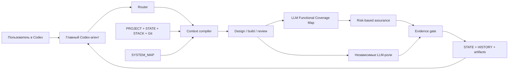

# Архитектура ARIA Codex 1.5

## Identity, Access & Backlog 1.5

ARIA 1.5 остаётся local-first control plane. Machine runtime хранит защищённые приватные
device keys; project docs хранят только публичные ключи, подписанную access policy и
подписанный backlog. `actor_id` стабилен для человека, `device_id` и Ed25519 key уникальны
для каждой машины.

`ACCESS.yaml` — каноническая policy с monotonic revision, device registry, permissions и
version/branch scopes. Её signer должен быть закреплён в `TRUST.yaml`. Изменения политики
пишутся атомарно и получают отдельную подписанную hash-chain в `ACCESS_HISTORY.jsonl`.

`BACKLOG.yaml` объединяет состояние и подписанные события в одном атомарно заменяемом файле.
`PROJECT.yaml.governance` объявляет этот файл единственным authority для живых task statuses.
Product Markdown может хранить требования и решения, но не является вторым независимо
изменяемым state store. Если указан `decision_registry`, ARIA детерминированно читает его
Markdown-таблицу и строит reconciliation plan для связанных clarification items.
Optimistic revision даёт ровно одного победителя при конкурирующем claim. Runs, blockers,
review findings и failed execution receipts обнаруживаются по стабильному source id,
поэтому повторная синхронизация не создаёт дубликаты. Terminal run автоматически
переводит связанный элемент в `done` или `blocked`.

Общая синхронизация выполняется Git-репозиторием. ARIA обнаруживает конфликт policy/backlog,
но без внешнего coordinator не предоставляет distributed real-time lease и совместную
запись одного run.

## Team & Trusted CI 1.4

ARIA 1.4 не добавляет центральный сервер. Координация остаётся project-local: actor registry
лежит в `ARIA_TEAM.yaml`, trust policy — в `TRUST.yaml`, leases/revision — в machine runtime.
Код по-прежнему принадлежит Git, а каждый участник работает в отдельной ветке и run.

Portable evidence отделено от локального runtime. Evidence Package v2 подписывает
manifest Ed25519-ключом, инвентаризирует каждый receipt/log/contract и проверяется offline.
Cryptographic validity и policy trust — разные verdicts.

CI использует provider-neutral job/result protocol. `prepare` связывает job с commit,
nonce и immutable contracts; `execute` работает в detached worktree; `import` fail-closed
сверяет все bindings и trust policy. GitHub Actions — только reference adapter.

Integration gate не агрегирует старые PASS механически: после merge требуется отдельный
`ci-signed` integration run на итоговом commit, связанный с точными SHA всех source
packages и независимым reviewer. Полная схема и эксплуатационные команды описаны в
`docs/TRUSTED_CI.md`.

## Trusted Execution & Evidence 1.3

`VERIFY.yaml` является декларативным execution contract проекта. При старте run ARIA
снимает его неизменяемый snapshot. `aria verify` исполняет только структурированные argv
через разрешённый stack adapter без shell и выпускает receipt, связанный с contract SHA и
точным Git HEAD/worktree. Raw output хранится отдельно и входит в receipt по SHA-256.

`execution.py` строит Evidence Bundle из receipts и проверяет его повторно при closure.
Bundle валиден только для текущего product Git state, неизменного execution contract и
полного покрытия обязательных assurance classes. Convergence дополнительно требует, чтобы
acceptance proof был связан с receipt, содержащим соответствующие requirement/acceptance ids.
Это отделяет семантическое решение Codex от доверенной границы фактического исполнения.

## Lifecycle layer 1.2

`aria/lifecycle.py` — публичный orchestration layer над неизменными gates 1.1. Он хранит
engine-managed `lifecycle.json`, проверяемые Markdown-артефакты фаз и переводит run только по
порядку `specify → clarify → plan → tasks → implement → converge`. Lifecycle не заменяет
Feature Contract: команда `implement` вызывает существующий lock, а `converge` — существующий
closure validator.

Spec Kit interchange является адаптером, а не вторым источником истины. Импорт читает
`spec.md`, `plan.md`, `tasks.md`, строит и валидирует Feature Contract; экспорт проецирует
зафиксированный контракт обратно в эти три файла. Каноническим runtime gate остаётся Feature
Contract ARIA. Exact `[FR-001]` annotations связывают acceptance, plan и tasks; без них import
не переводит контракт в `ready`.

Contract amendment образует append-only логическую цепочку. Каждая запись хранит previous
lock, SHA предыдущего run contract, SHA before/after, причину и immutable revision artifacts.
Текущий lock receipt указывает на предыдущий run contract; `_validate_run_identity` проверяет
всю цепочку и содержимое revision artifacts перед closure.

`aria/project_init.py` строит первый project map из Git tracked inventory. Детерминированный
bootstrap помечает неизвестные зависимости как unknown и не заявляет понимание семантики,
которого нет в кодовых фактах.

`aria/release_check.py` создаёт изолированный acceptance workspace, wheel bundle, clean venv,
installed-CLI проверки, disposable project smoke и единый JSON-отчёт. Любой skipped/failed
check делает итоговый verdict отрицательным.

## Решение

ARIA — control plane для Codex, а не второй исполнитель проекта. Семантическую работу
выполняет LLM; Python-ядро оставляет только детерминированные границы, которые полезно
проверять машинно.

## Модули

- `cli.py` — один публичный project-aware интерфейс;
- `registry.py` — локальная регистрация нескольких проектов;
- `framework_doctor.py` — self-diagnostics без product env;
- `project.py` — roots, Git inventory, fingerprints, doctor, history;
- `identity.py` — device keys, DPAPI/local protection и enrollment request;
- `access.py` — signed project access, scopes, grants, revoke и audit;
- `backlog.py` — signed backlog lifecycle и automatic source reconciliation;
- `migration_1_5.py` — recoverable upgrade 1.4 → 1.5;
- `collaborative_migration.py` — plan/backup/cutover/recovery/rollback из offline 1.5.5
  в protected collaborative control plane;
- `project_state.py` — schema v2 frontier/roadmap;
- `assurance.py` — system map, blast radius, test/review plan и evidence;
- `execution.py` — safe adapters, trusted receipts, resume и Evidence Bundle validation;
- `routing.py` — intent/mode routing без смешивания с closure;
- `run_contracts.py` — role, functional coverage и closure contracts;
- `feature_contract.py` — requirements, clarify/plan/tasks и convergence validation;
- `simple_run.py` — orchestration start/closure и recoverable transaction;
- `project_activation.py` — isolated canary и active cutover;
- `lessons.py` — компактная hash-linked behavior memory;
Удалённый legacy-engine и bootstrap migration writer не находятся на runtime path и не импортируются CLI. Уже импортированные pointer-only traces читаются как исторические данные, но production ARIA их не переписывает.

## Поток run

1. Project doctor проверяет roots, manifests, STATE/HISTORY, Git, SYSTEM_MAP и runtime.
2. Router выбирает mode/intent/mechanism.
3. Git snapshot исключает только явно настроенные legacy prefixes.
4. SYSTEM_MAP связывает changed paths с компонентами/shared primitives.
5. Assurance planner задаёт минимальные обязательные test classes, review dimensions и scenario contract.
6. Context compiler создаёт bounded Markdown и immutable manifest/scope.
7. Standard/deep design и build создают Feature Contract с requirements, acceptance,
   resolved clarifications, implementation plan и ациклическим task graph; отдельный lock
   замораживает его SHA до product Git delta, цепляет start-anchor к отдельному lock-receipt
   и переводит immutable run contract в execution.
8. Для component/repository review LLM сначала строит Functional Coverage Map и выводит
   дополнительные test obligations; независимый reviewer ищет пропуски.
9. LLM проектирует Mission Supertest для каждого runtime-компонента и отдельные тестовые
   векторы для несовместимых режимов/локализации дефектов.
10. Codex выполняет работу и остальные независимые роли; настроенные команды тестирования
    запускает `aria verify`, которая создаёт receipts и Evidence Bundle.
11. Standard/deep build выполняет convergence: requirement связывается с completed task и
    Git path, каждый acceptance oracle — с отдельным проверенным raw-output proof excerpt.
12. LLM синтезирует post-assurance problem report: отделяет дефекты от рисков, окружения и
   не-багов, устанавливает production root cause и предлагает промышленный root fix с
   проверками приёмки.
13. Evidence gate проверяет raw output, excerpt, requirement/functional/file/dimension
    coverage, scope, Git delta и roles.
14. Shadow сохраняет result локально; active выполняет recoverable project transaction.

## System Map

Карта проверяется по schema, project identity, Git object, working-tree SHA, уникальным
component ids и безопасным paths. Freshness является advisory: карта может устареть во
время параллельной разработки, поэтому run не блокируется, но контекст требует повторного
анализа. Candidate принимается только для текущего Git/worktree, только от deep repository review и публикуется active closure. Candidate не может удалить существующие component/shared-primitive/critical-flow ids или значения dimensions.

Изменение path, принадлежащего shared primitive, автоматически повышает assurance до full и
добавляет integration, E2E, adversarial и full regression соседних потоков. Для обычного
компонента план также читает его risks/test seams, reverse dependents и участие в critical
flows: распознанные security/concurrency/recovery/migration/performance/safety-риски становятся
обязательными test classes, а не остаются декоративным текстом карты.

## Assurance contract

План различает обязательное исполнение и обязательную оценку применимости. Для выполненного
теста нужны class(es), command, exit code 0, raw output, SHA, присутствующий excerpt и actual
result. Один связный сценарий может доказать несколько classes, но `class_evidence` обязан дать каждому классу собственные proof excerpts, реально найденные в raw output; load/concurrency/stress/soak дополнительно связываются с JSON-метриками из того же output. Для complex classes нужен связный scenario contract. `not_applicable`
разрешён только для assessment classes и требует конкретного rationale; им нельзя закрыть
обязательный executed class.

Repository review получает assurance-campaign: E2E, adversarial, concurrency, load, stress,
recovery, full regression и assessment оставшихся risk classes. Coverage artifact задаёт
полную биекцию со scope files и review dimensions.

Functional Coverage Map — отдельный LLM-first слой между scope и тестами. Его контракт
стабилен только на уровне пяти смысловых headings; содержание остаётся свободным Markdown.
LLM описывает material behavior, данные/состояния, реальные cross-layer bindings,
failure/boundary/composition cases и test obligations. Python проверяет путь внутри run,
UTF-8 Markdown, SHA, scope SHA и непустые headings, но не кодирует типы нод, поля продукта
или матрицу комбинаций. Семантическую полноту проверяет независимый
`functional_coverage_reviewer`. Его artifact дополнительно связывает SHA карты/scope с
точным digest объявленного verification evidence, а общий role target уже связывает raw
outputs; подмена тестовых classes/scenario/evidence после review инвалидирует closure.

Mission Supertest — LLM-first capstone assurance campaign. Functional Coverage Map задаёт
его продуктовую цель, SUT focus, покрываемые возможности, соседей, failure hypotheses,
oracle/invariants, load/fault profile, read-backs и границы доказательства. Существующий
scenario contract и multi-class evidence сохраняют факты; отдельная domain-specific схема
или комбинаторный генератор не нужны. Независимый reviewer проверяет, что сценарий решает
реальную задачу, проходит по пользовательскому/runtime пути, пытается сломать SUT и не
подменяет live browser/provider/hardware mock-слоем. Focused/integration векторы остаются
обязательными для локализации и несовместимых режимов.

Post-assurance synthesis остаётся LLM-first слоем, а не domain-specific rule engine.
Детерминированные evidence gates подтверждают факты, но Codex связывает их с влиянием,
корневой причиной и промышленным продуктовым решением. Контракт требует честно отличать
доказанную причину от гипотезы, устранять причину вместо симптома и учитывать архитектуру,
security, data integrity, compatibility/migration, observability и operations без
переусложнения нового проекта универсальными валидаторами.

## Независимость review

Manifest фиксирует роли до работы. Role artifact привязан к run/context и SHA финального предмета проверки (diff/scope/spec и raw outputs), имеет независимый
agent id, read-only flags, verdict и findings с evidence/resolution. Standard использует
`functional_coverage_reviewer` плюс общий независимый reviewer для обычного
component/repository review, deep build — C1/adversarial/C2, deep
component/repository review дополнительно — architecture,
adversarial и test reviewers; security role добавляется по риску.

## Транзакции и целостность

Active closure работает под lock:

1. проверяет immutable run identity, текущий engine SHA и совпадение STATE checkpoint с HISTORY head;
2. сохраняет preimage STATE/HISTORY/публикуемых документов;
3. строит hash-linked event;
4. делает atomic replace и byte read-back;
5. проверяет history chain;
6. при любой ошибке восстанавливает preimage;
7. prepared journal содержит roots, точный target inventory и SHA до/после; retry сначала
   откатывает публикации/STATE/HISTORY, а уже затем повторяет input validation;
8. новый run не может закрыться, пока последний incomplete run не восстановил STATE.

Active cutover имеет отдельный project-scoped CAS journal. Recovery изменяет только entry
активируемого проекта в registry, сохраняет параллельно зарегистрированные проекты и
отказывается писать при смене resolved docs/code roots.

Governed build дополнительно требует clean Git baseline, claimed backlog item того же actor,
immutable run binding и успешный write preflight. Dirty checkout без started build-run
переходит в `RECOVERY_REQUIRED`; новый run не может задним числом присвоить себе изменения.
В shadow mode активность подтверждается local runtime manifest, а не записью frontier.
Закрытый bound run синхронизирует тот же backlog item; повтор closure повторяет recovery,
поэтому сбой между project closure и signed backlog transition остаётся восстанавливаемым.

Если operational engine SHA изменился, stale active-проект нельзя запускать напрямую. Та же
canary/CAS-транзакция проверяет новый engine на изолированной копии, атомарно обновляет
binding и пишет hash-linked событие `aria_engine_rebind`; ручное редактирование registry не
требуется.

Operational engine SHA включает Python runtime, `.agents/skills`, `AGENTS.md`, pyproject и
root marker. Документация, tests и generated caches исключены.

## Источники истины

- Git — код и его история;
- `STATE.yaml` — компактная текущая project map;
- `HISTORY.jsonl` — полная append-only process trace;
- `STACK.md` + реальные manifests — технологии и команды;
- `SYSTEM_MAP.yaml` — проверяемый, но обновляемый LLM-кэш архитектуры;
- specs/ADR/research — только долговременные решения;
- local runtime — raw context, scope, output, roles, results и snapshots.
